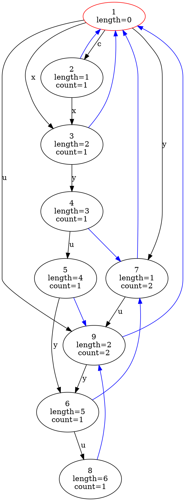

```dot
digraph {
  1 [color=red];
  1 [label="1\nlength=0"];
  1 -> 2 [label="c"];
  1 -> 3 [label="x"];
  1 -> 7 [label="y"];
  1 -> 9 [label="u"];
  2 [label="2\nlength=1\ncount=1"];
  2 -> 1 [color=blue];
  2 -> 3 [label="x"];
  3 [label="3\nlength=2\ncount=1"];
  3 -> 1 [color=blue];
  3 -> 4 [label="y"];
  4 [label="4\nlength=3\ncount=1"];
  4 -> 7 [color=blue];
  4 -> 5 [label="u"];
  5 [label="5\nlength=4\ncount=1"];
  5 -> 9 [color=blue];
  5 -> 6 [label="y"];
  6 [label="6\nlength=5\ncount=1"];
  6 -> 7 [color=blue];
  6 -> 8 [label="u"];
  7 [label="7\nlength=1\ncount=2"];
  7 -> 1 [color=blue];
  7 -> 9 [label="u"];
  8 [label="8\nlength=6\ncount=1"];
  8 -> 9 [color=blue];
  9 [label="9\nlength=2\ncount=2"];
  9 -> 1 [color=blue];
  9 -> 6 [label="y"];
}
```